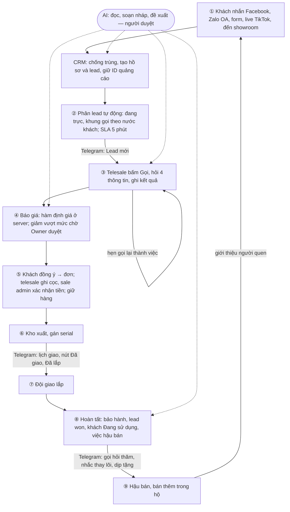

# Hành trình một khách: từ tin nhắn đầu tiên đến hồ sơ hoàn tất

Một chu trình trọn vẹn — khách mới nhắn qua Facebook hay nền tảng khác, đến khi giao lắp xong, bảo hành sinh ra và
hồ sơ hoàn tất — kèm rõ **ai làm gì ở từng đoạn**: nhân viên thao tác gì, Telegram xuất hiện ở đâu, AI can thiệp chỗ
nào. Kế hoạch làm từng đoạn nằm ở [`ke-hoach-thong-luong.md`](ke-hoach-thong-luong.md).

Sơ đồ vẽ **trạng thái đích** (khi làm xong các lát); dòng **Hôm nay** dưới mỗi giai đoạn ghi phần nào đã chạy thật
(cập nhật 06/10/2026, sau lát 0). Phần AI bám đúng khung đã chốt ở `CLAUDE.md` mục 10.7, không vẽ thêm.

**Năm tác nhân:** Khách · Hệ thống CRM (luật tự chạy) · AI · Nhân viên (Sale admin, Telesale, Kho & giao lắp) ·
Telegram (kênh đẩy việc tới điện thoại nhân viên).

---

## 1. Sơ đồ tổng — một vòng đời khách



Bản chữ dưới đây giữ để đọc được ngay trên điện thoại và terminal.

```
 KHÁCH            HỆ THỐNG CRM               AI (đề xuất)        NHÂN VIÊN                TELEGRAM
 ─────            ────────────               ────────────        ─────────                ────────
 ① Nhắn Facebook ─► Nhận, chống trùng,
   / Zalo / Form    tạo hồ sơ + lead       ─► Soạn nháp trả lời
   / Live TikTok    (giữ ID quảng cáo)        đầu (xin số,
                         │                    mời qua Zalo OA)
                         ▼
 ② ─────────────── Phân lead tự động ────────────────────────────────────────────────► "Lead mới" + tóm tắt
                    (vòng tròn, đang trực,                                              (mức Đầy đủ)
                    khung gọi theo nước)   ─► Chấm điểm lead
                    SLA 5 phút bắt đầu
                         │
 ③ Nghe máy ◄──────────────────────────────────────────────── Telesale bấm Gọi,
                                            Gợi ý câu hỏi      hỏi 4 thông tin,
                                            còn thiếu          ghi kết quả           ◄── "Hẹn gọi lại" [Xong]
                    Hẹn gọi lại → việc ◄──────────────────────                           "Lead quá hạn" (SA)
                         │
 ④ Mở link báo giá ◄── Tính giá ở server ◄── Đề xuất offer ◄── Tạo báo giá
   bấm Đồng ý           (hàm định giá duy      hợp hồ sơ          (đủ 4 thông tin
                        nhất)                  (qua hàm giá)       mới cho tạo)
                         │ giảm vượt mức ───────────────────► Owner duyệt  ◄────────── "Chờ duyệt" / "Đã duyệt"
                         ▼
 ⑤ Chuyển cọc ───────► Sinh đơn, lead → deposit                Telesale ghi khoản ◄──── Gửi ảnh chuyển khoản
                         │                                     Sale admin xác nhận ◄─── "Tiền chờ xác nhận"
                         ▼                                     (người ghi ≠ người     [Xác nhận]
                    Giữ hàng, hết hạn tự nhả                    xác nhận)
                         │
 ⑥ ─────────────── Phiếu xuất kho ◄──────────────────────────── Kho xuất, gán serial ◄─ "Việc xuất kho"
                    (tồn chỉ đổi qua phiếu)
                         │
 ⑦ Nhận hàng ◄───── Đơn đang giao ◄──────────────────────────── Đội giao lắp ◄────────── "Lịch giao hôm nay"
   được lắp                                                       giao, lắp, bàn giao     [Đã giao][Đã lắp]
                         │                                                                [Báo vướng]
                         ▼
 ⑧ ─────────────── Đơn hoàn tất:                                                     ─► "Đơn hoàn tất"
                    • sinh phiếu bảo hành (serial)
                    • lead → won, khách → "Đang sử dụng"
                    • sinh việc hậu bán            ─► Đề xuất việc
                    • gửi chuyển đổi về Facebook      tiếp theo
                         │
 ⑨ Được hỏi thăm ◄─────────────────────────────────────────── Telesale gọi ◄─────────── "Gọi hỏi thăm" (+3 ngày)
   Thay lõi, dịp tặng                              Nhắc dịp,     hỏi thăm, bán thêm      "Nhắc thay lõi"
   Giới thiệu bạn ──► lead mới (quay về ①)        bán thêm                               "Nhắc dịp tặng"
```

---

## 2. Từng giai đoạn

### ① Khách chạm lần đầu

| Tác nhân | Làm gì |
|---|---|
| Khách | Nhắn Messenger, điền Form quảng cáo Facebook, nhắn Zalo OA, để số dưới live TikTok, hoặc đến showroom |
| Hệ thống | Webhook nhận thô → kiểm chữ ký → chuẩn hóa số (VN, Hàn) → tìm trùng theo định danh → tạo `contacts`, `contact_identities`, `leads`, `consents`. **Giữ nguyên ID quảng cáo** trong `source_detail` để về sau gửi chuyển đổi ngược. Khách cũ có lead đang mở thì nối vào lead cũ, không tạo mới |
| AI | *Soạn nháp* câu trả lời đầu cho Messenger — mục tiêu xin số hoặc mời khách qua Zalo OA trong 24 giờ đầu (Messenger chỉ cho trả lời 24 giờ). **Người bấm gửi** |
| Nhân viên | Không phải làm gì nếu luật chạy. Live TikTok và khách đến showroom thì nhập nhanh |
| Telegram | Ngoài giờ, chưa ai trực: báo sale admin "lead chưa phân" |

**Hôm nay:** chống trùng và chuẩn hóa số có code và test. Webhook Meta, Zalo **chưa làm** (lát 1, cần tên miền
HTTPS). Messenger là tháng 2.

### ② Phân việc

| Tác nhân | Làm gì |
|---|---|
| Hệ thống | Chọn người có quyền `lead.receive`, đang bật Trực, không nghỉ; vòng tròn, bỏ qua người đang ôm quá N lead chưa gọi. Khách ở Hàn đến lúc 10:00 sáng VN thì **chờ tới 19:00 giờ Hàn** mới giao, để lead không rơi vào người đã hết ca. SLA 5 phút bắt đầu |
| AI | *Đề xuất* điểm ưu tiên lead (tháng 3) |
| Telegram | Telesale nhận **"Lead mới"** mức Đầy đủ: nguồn, ngân sách, dịp, tỉnh người nhận, khung gọi tốt, còn thiếu gì |

**Hôm nay:** tin Telegram **đã chạy thật**. Logic phân lead có code và test, chưa nối tự chạy.

### ③ Telesale gọi, tư vấn

| Tác nhân | Làm gì |
|---|---|
| Nhân viên (Telesale) | Bấm **Gọi** → server trả số **chỉ của lead đang giao cho mình**, ghi nhật ký mỗi lượt xem số → gọi bằng điện thoại hoặc Zalo → hỏi **4 thông tin bắt buộc** (mua cho ai, người nhận ở tỉnh nào, dịp, ngân sách) → ghi kết quả dưới 30 giây. Ngày quan trọng nghe được (sinh nhật bố, mừng thọ mẹ) ghi vào hồ sơ |
| Hệ thống | Lần liên hệ đầu dừng đồng hồ SLA. Hẹn gọi lại thành một **việc** có hạn, giờ gợi ý luôn nằm trong khung gọi của nước khách |
| AI | *Đọc* và tóm tắt hồ sơ trước cuộc gọi; *đề xuất* câu hỏi còn thiếu. Tháng 3, khi có tổng đài ghi âm: tóm tắt cuộc gọi. Câu hỏi về sức khỏe, bệnh lý thì **chuyển cho người**, AI không trả lời |
| Telegram | **"Đến giờ hẹn gọi lại"** kèm nút **Xong** / **Hẹn lại 1 giờ**. Trả lời tin của bot thành **ghi chú trên hồ sơ**, gửi ảnh thành ảnh trong hồ sơ. Sale admin nhận **"Lead quá hạn"** của đội |

**Hôm nay:** **đã chạy thật cả đoạn này** (lát 0): màn Việc cần làm, hồ sơ lead `/leads/<id>`, nút Gọi trả số của
đúng lead đang giữ và ghi nhật ký, ghi kết quả gọi (dừng SLA, đóng việc gọi, sinh việc hẹn gọi lại trong khung giờ
của khách), ghi chú, ngày quan trọng, chặn sang Demo khi thiếu 4 thông tin, đánh thất bại có lý do. Phía Telegram
chạy thật cả hai chiều; nút Xong trên Telegram và trên CRM đi qua cùng một hàm database.

### ④ Báo giá

| Tác nhân | Làm gì |
|---|---|
| Nhân viên (Telesale) | Tạo báo giá từ hồ sơ — **không cho tạo khi chưa đủ 4 thông tin**. Gửi khách link |
| Hệ thống | Một hàm định giá duy nhất ở server: áp khuyến mãi theo ưu tiên, combo, phí giao lắp theo tỉnh, mức cọc. Giảm tay vượt giới hạn vai trò → vào hàng chờ duyệt. Gửi báo giá đầu tiên thì lead tự sang `quoted` — **người không kéo tay được** |
| AI | *Đề xuất* offer hợp hồ sơ (khách ở Hàn mua tặng mừng thọ → combo nào, chính sách nào đang chạy). **Luôn đi qua hàm định giá**, không tự đặt giá. Đề xuất vào hàng chờ duyệt, người quyết |
| Khách | Mở link trên điện thoại (không đăng nhập), thấy ảnh, giá, chính sách giao lắp, bảo hành, hướng dẫn chuyển khoản; bấm **Đồng ý** |
| Telegram | Owner nhận **"Có việc chờ duyệt"**; telesale nhận **"Đề xuất của tôi đã được duyệt / từ chối"** |

**Hôm nay:** hàm định giá có code và test. Tin duyệt Telegram **đã chạy thật**. Bảng báo giá **chưa có** (lát 3).

### ⑤ Đơn và tiền

| Tác nhân | Làm gì |
|---|---|
| Hệ thống | Khách đồng ý → sinh đơn, **chạy lại định giá để kiểm** không có gì đổi. Đơn lưu ảnh chụp giá và chính sách lúc chốt. Đơn quà tặng tách người đặt (trả tiền, có thể ở Hàn) và người nhận (địa chỉ giao) |
| Nhân viên (Telesale) | Ghi nhận khoản cọc kèm ảnh chứng từ |
| Nhân viên (Sale admin) | **Xác nhận tiền đã về.** Người ghi không tự xác nhận được khoản của mình |
| Hệ thống | Đủ cọc → `deposit_paid` → **giữ hàng**; lead sang `deposit`. Hết hạn giữ mà chưa đủ tiền → tự nhả hàng, báo người bán |
| Telegram | Telesale **gửi ảnh chuyển khoản ngay trên Telegram** → thành khoản chờ xác nhận. Sale admin nhận **"Tiền chờ xác nhận"** kèm nút **Xác nhận** |
| Sau này | Tháng 2, dịch vụ báo biến động số dư tự khớp theo mã đơn trong nội dung chuyển khoản |

**Hôm nay:** logic đơn, giữ hàng có code và test. Bảng đơn, thanh toán **chưa có** (lát 3).

### ⑥ Kho

| Tác nhân | Làm gì |
|---|---|
| Nhân viên (Kho) | Lập phiếu xuất, **gán serial** cho ghế, máy lọc |
| Hệ thống | Tồn **chỉ đổi qua phiếu đã ghi sổ**. Chưa có phiếu xuất đã ghi sổ và serial thì đơn không chuyển sang Đang giao được |
| Telegram | Nhóm Kho & giao lắp nhận **"Việc xuất kho"** |

**Hôm nay:** logic kho có code và test. Bảng kho **chưa có** (lát 2).

### ⑦ Giao lắp

| Tác nhân | Làm gì |
|---|---|
| Nhân viên (Đội giao lắp) | Xác nhận người nhận và lịch giao, giao, lắp, bàn giao. **Bấm nút ngay trên Telegram**, không cần mở CRM |
| Hệ thống | Mỗi bước giao lắp là một **việc** có người nhận và hạn, không phải tin nhắn trôi. Đơn `delivering` → `installed`. Lead bật "Giữ bất ngờ" thì không liên hệ người nhận khi người đặt chưa cho phép |
| Telegram | **"Lịch giao hôm nay"** kèm nút **Đã giao** / **Đã lắp** / **Báo vướng** |
| Sau này | Tháng 2, video bàn giao lưu kho riêng tư; app riêng cho kỹ thuật viên làm sau |

**Hôm nay:** màn giao lắp có bản demo (nằm trong hồ sơ đơn). **Chưa có** bảng và vai trò Kho & giao lắp (lát 4).

### ⑧ Hoàn tất

Khi đơn sang **Hoàn tất**, hệ thống tự làm một loạt việc — đây là điểm "đóng hồ sơ":

- Sinh **phiếu bảo hành** theo serial, thời hạn theo chính sách, chủ sở hữu là người nhận.
- Lead sang `won`; khách sang giai đoạn **"Đang sử dụng"**.
- Luật sinh việc hậu bán: **gọi hỏi thăm sau 3 ngày**, **nhắc thay lõi theo chu kỳ** (máy lọc), nhắc hết hạn bảo
  hành, mời giới thiệu.
- Tháng 2: gửi sự kiện chuyển đổi **ngược về Facebook** gắn với quảng cáo gốc — đóng vòng đo hiệu quả quảng cáo.

| Tác nhân | Làm gì |
|---|---|
| AI | *Đề xuất* việc tiếp theo cho khách này (bổ sung cho luật cố định) |
| Telegram | Telesale nhận **"Đơn hoàn tất"** |

### ⑨ Hậu bán và tái bán — vòng quay lại

| Tác nhân | Làm gì |
|---|---|
| Nhân viên (Telesale) | Gọi hỏi thăm, nhắc thay lõi, bán thêm trong hộ (bố mẹ đã có ghế → con mua máy lọc) |
| AI | *Đề xuất* dịp tặng sắp tới, sản phẩm hợp hộ đó, *soạn nháp* tin chăm sóc. Chỉ gửi khi khách **đã đồng ý** mục đích đó |
| Telegram | **"Gọi hỏi thăm"**, **"Nhắc thay lõi"**, **"Nhắc dịp tặng"** (21 ngày trước dịp) |
| Khách | Giới thiệu người quen → **lead mới, quay về ①**, gắn người giới thiệu |
| Hệ thống | 90 ngày không tương tác → khách sang "Ngủ đông", sinh việc làm nóng lại (mặc định tắt) |

---

## 3. AI làm gì, và không bao giờ làm gì

Theo `CLAUDE.md` mục 10.7. **Tháng 2** dựng nền chỉ đọc; **tháng 3** bật trợ lý. Giai đoạn 1 chưa có AI chạy thật.

**Bốn mức hành động**, tháng 2–3 chỉ dùng ba mức đầu:

| Mức | Ví dụ trong hành trình | Ai quyết |
|---|---|---|
| Đọc | Tóm tắt hồ sơ trước cuộc gọi (③), tóm tắt cuộc gọi khi có ghi âm (③) | — |
| Soạn nháp | Tin trả lời Messenger đầu tiên (①), tin chăm sóc hậu bán (⑨) | Nhân viên bấm gửi |
| Đề xuất cần duyệt | Offer cho báo giá (④), điểm ưu tiên lead (②), việc tiếp theo (⑧), gộp hộ khi có từ 2 bằng chứng | Vào hàng chờ duyệt |
| Tự làm | Mặc định **không có**. Chỉ việc Owner bật riêng | Owner |

**AI không bao giờ:** xem số điện thoại đầy đủ; xem giá vốn; xuất file; tự duyệt đề xuất của mình; tự đặt giá
ngoài hàm định giá; gửi tin khi khách chưa đồng ý; liên hệ người nhận khi đơn đang Giữ bất ngờ; gọi ngoài khung
giờ của nước khách; trả lời câu hỏi sức khỏe, bệnh lý.

**Vì sao chặn được thật:** các luật trên nằm ở lớp nghiệp vụ và database, không nằm trong lời dặn AI. AI gọi cùng
hàm nghiệp vụ như nhân viên, chạy dưới quyền của người đang dùng, nên không lách được. Mọi việc AI làm ghi
`actor_type = 'ai'` kèm mô hình, dữ liệu đầu vào đã dùng và chi phí.

---

## 4. Telegram làm gì, và không làm gì

**Làm:** đẩy đúng việc tới đúng người lúc cần (11 loại tin ở bảng trên); cho bấm nút xác nhận ngay trên điện thoại
(Xong, Hẹn lại, Xác nhận tiền, Đã giao, Đã lắp, Báo vướng); nhận ngược trả lời thành ghi chú, ảnh thành chứng từ —
**tất cả về đúng hồ sơ trong CRM, ghi đúng tên người làm**.

**Không làm:** nhắn khách (khách vẫn qua Zalo OA, điện thoại); mang số điện thoại đầy đủ, địa chỉ chi tiết hay nội
dung tin của khách; đọc trò chuyện trong nhóm của đội; thay CRM làm nơi lưu quyết định. Muốn xem đủ thì bấm mở
CRM, nơi kiểm quyền và ghi nhật ký.

---

## 5. Hồ sơ "hoàn tất" trông thế nào

Sau một vòng, mở hồ sơ khách sẽ thấy trên **một dòng thời gian**: nguồn quảng cáo gốc · lần phân lead · từng cuộc
gọi và kết quả · ghi chú (kể cả gửi từ Telegram) · báo giá đã xem, đã đồng ý · khoản cọc ai ghi ai xác nhận · phiếu
xuất kho và serial · từng bước giao lắp · phiếu bảo hành · lịch nhắc thay lõi · ngày quan trọng của cả hộ. Đây là
nguồn cho tiêu chí "hiểu rõ vòng đời khách" ở `CLAUDE.md` mục 1.2.

---
